# microspec

**An AI can't merge a broken app here.**

microspec is an open-source framework for AI-authored, installable micro-PWAs. An agent writes a thin
**spec** (+ a tiny data adapter) against a **verified runtime**, and hard **CI gates** — accessibility,
responsiveness, end-to-end behavior, runtime-error surveillance — *block the merge* if the app is broken,
inaccessible, or untranslated. The constraint is the point: a narrow spec + a gated runtime is what makes
agent-generated apps **verifiably** correct instead of hopefully correct.

[](https://github.com/damanoreshkan-beep/microspec/actions/workflows/verify.yml)
[](packages/gates/efficacy.mjs)
[](https://damanoreshkan-beep.github.io/microspec/store/)
[](LICENSE)

> **▶ Try the farm live:** **[28 installable apps](https://damanoreshkan-beep.github.io/microspec/store/)** —
> each is a spec + adapter that passed the gates. Add any to your home screen; they work offline.

<p align="center">
  <a href="https://damanoreshkan-beep.github.io/microspec/store/">
    
  </a>
  <br><sub>The gate catching a real mistake — an agent's dropped translation — in ~2 seconds. Only green merges.</sub>
</p>

---

## The problem

"Prompt → app" is now commodity — Lovable, v0, Bolt, Cursor all generate freeform code. The universal
catch: the output is often inaccessible, non-responsive, or subtly broken, and **you can't trust it
without reviewing every line.** Freeform generation has no floor.

## The idea

Give the agent a **floor it cannot fall through:**

1. **Constrain the surface.** Apps are declared as a JSON **spec** against a fixed runtime with five
   families (`list · dashboard · converter · tool · profile`) and detail / search / filters / i18n / PWA
   baked in. The agent writes structure, not a framework.
2. **Gate everything in CI.** A headless-Chromium harness runs the app in every state and **fails the
   build** on any violation. Red gate → no merge. Green gate → auto-deploy to GitHub Pages.

The 28-app farm is the proof, and doubles as the regression suite for the runtime itself.

## The gate (this is the wedge)

Every changed app is run through a real browser (Astral + Chromium + axe-core) across its **loading,
settled, and animated** states, and watched for runtime errors the whole time:

| Check | What fails the build |
|---|---|
| **Accessibility** | any axe-core violation of `critical` / `serious` impact — in **both** light & dark themes |
| **Responsive @384px** | any horizontal overflow at true phone width |
| **Glanceable @200px** | content that doesn't fit a smartwatch-width container |
| **End-to-end** | app-authored `e2e.spec.mjs` assertions (`count · click · type · back · prop · waitFor …`) |
| **Runtime errors** | any uncaught error or `console.error` during any state |
| **Render integrity** | blank render, unclosed tags, missing i18n keys, content-less spinners (browser-free `preflight`, ~2s) |

An agent that introduces an inaccessible contrast pair, an element that overflows the watch, or a view
that throws **cannot get its PR merged.** No human has to catch it.

## Measured, not claimed

"The gate catches bugs" is itself testable. [`packages/gates/efficacy.mjs`](packages/gates/efficacy.mjs)
**mutation-tests the gate**: it injects a catalog of realistic agent mistakes — a dropped translation, an
invalid spec, a banned spinner, a throwing view — into a *copy* of each app (the real tree is never
touched) and records whether the gate goes red. The score is caught / total: a number, not a promise.

The first run scored **79%** — and surfaced a real gap: the browser-free tier wasn't enforcing that every
locale defines the same keys, so an app could ship an untranslated runtime string. We added a locale-parity
check and it went to **100% (51/51)**. That loop — *measure → find a gap → close it → re-measure* — now runs
in CI, so a regression in the **gate itself** fails the build.

It has since run again, on a gap that cost two shipped defects: headless has no GPS and no magnetometer, so
a sensor app rendered its *empty* state and every check below — a11y, overflow@384, watch@200 — signed off
on a screen no user sees. A compass rose overflowed by 39px unmeasured (a rotated square's bounding box
grows √2, but a dial with no heading never rotates); a readout failed contrast in both themes because the
element never mounted. Preflight now fails any app that reads a sensor and renders no live state, and
`sensor-mock-unseeded` mutates the *cause* — it disables the gate detection so the mock stops seeding —
rather than the marker. **52/52.**

Both tiers are measured and enforced:

| Tier | Catches | Score |
|---|---|---|
| **preflight** (browser-free) | dropped translation · invalid spec · banned spinner · throwing view · locale drift · unseeded sensor mock | **100%** (52/52) |
| **verify** (Chromium, in CI) | broken data adapter · failing e2e · **inaccessible control (axe)** | **100%** (6/6) |

The verify tier proves the headline the hard way: a mutation that strips a control's accessible name is
**caught by axe in CI**, by measurement, not assertion. (One honest footnote: a synthetic *overflow* probe
escaped — the dock truncates an over-long label — so we dropped it; overflow@384 is already enforced across
all 28 apps on every push.)

### …and what the gates still cannot see

Measuring the gate's strength without measuring its blind spots would be marketing. The same rigour is
turned on itself in **[`docs/GATE_BLINDSPOTS.md`](docs/GATE_BLINDSPOTS.md)**: a catalogue of real defects
that shipped **with every gate green**, each with the receipt.

The pattern is always the same — *a gate verifies that a mechanism exists; it does not ask whether the
mechanism achieves its purpose:*

| The gate asks | It does not ask |
|---|---|
| Does a manifest exist? | Can a user actually install this? |
| Does text render? | Is it in the reader's language? |
| Does each state pass contrast? | Can you tell the states apart? |

That last one is the sharpest: the dock's active tab was invisible for the life of this project at a
measured **1.56:1** against its inactive siblings — because axe checks text against its *background*, never
one state against *another*. Both states passed every check. The difference between them, which is the
entire point, passed nothing, because nothing looked.

A green gate is a floor, not a verdict.

## See it live

The farm runs on plain GitHub Pages, no backend:

| App | What it is |
|---|---|
| [**Habits**](https://damanoreshkan-beep.github.io/microspec/habits/) | a local-first streak tracker — IndexedDB, streak math, a 13-week contribution heatmap, JSON export; fully offline |
| [**Rave**](https://damanoreshkan-beep.github.io/microspec/rave/) | a polyphonic techno synth — 16 voices, an FX rack, a look-ahead scheduler, saved patterns; synthesised, no audio files. **Generate** is a scored search over Euclidean rhythms, not a dice roll |
| [**GPS Ruler**](https://damanoreshkan-beep.github.io/microspec/ruler/) | measure distance/area by walking a polyline — haversine segments, shoelace area, live coordinates, scale bar, north arrow |
| [**Frontier**](https://damanoreshkan-beep.github.io/microspec/frontier/) | fresh breakthrough OSS from GitHub, descriptions translated on-device |
| [**Neural Nets**](https://damanoreshkan-beep.github.io/microspec/hf/) | Hugging Face models & Spaces catalog with translated model cards |

**Not just feeds.** Habits is a stateful, offline productivity app (your data, exportable); Rave is a real
instrument; Ruler is a real GPS field tool. Read-only catalogs (Frontier, Neural Nets, weather) are one slice —

Depth lives in the runtime, not in the apps. `packages/runtime/groove.js` is four published results turned
into four functions — Toussaint's Euclidean rhythms (2005), the Longuet-Higgins & Lee syncopation measure
(1984), the inverted-U of groove from [Witek et al. (2014)](https://journals.plos.org/plosone/article?id=10.1371/journal.pone.0094446)
(pleasure peaks at *medium* syncopation), and harmonicity from [Bowling & Purves (2018)](https://www.pnas.org/doi/10.1073/pnas.1505768112).
Rave's Generate button samples that space and keeps the highest-scoring bar. The unit gate asserts
`bjorklund(3,8)` **is** the Cuban tresillo and that the search beats coin-flip random on every seed — so
"generated, not random" is a test, not a bullet point. Any future music app imports it for free.

…plus 23 more (`hn · rates · crypto · quakes · iss · launches · transit · sun · kp · globe · dou · …`).

## How it works

An app is three files the agent writes — `spec.json`, `i18n/*.json`, and `data.js` — plus boilerplate the
toolkit scaffolds. A spec is declarative:

```jsonc
{
  "id": "hn", "theme": "signal",
  "translate": ["title", "desc"],
  "fav": { "key": "id" },
  "tabs": [
    { "id": "feed", "type": "list", "search": true,
      "card": { "layout": "feed", "title": "title", "body": "desc",
                "badges": [ { "field": "points", "icon": "lucide:arrow-up" } ] } },
    { "id": "me", "type": "profile" }
  ]
}
```

```js
// data.js — the only imperative part: fetch → map to the item shape the card declares.
export async function load() {
  const r = await fetch("https://hn.algolia.com/api/v1/search?tags=front_page");
  const { hits } = await r.json();
  return { items: hits.map((h) => ({ id: h.objectID, title: h.title, desc: "", points: h.points })) };
}
```

The runtime renders it — accessible, responsive, installable, i18n, history-routed — and the gates verify
it. There is **no build step:** the runtime is browser-native ESM (Preact + htm + nanostores) from a CDN
import map; styling is Tailwind + DaisyUI.

## Layers

| Package | Role |
|---|---|
| `packages/schema` | the spec **contract** — JSON Schema (single source of truth) + ajv validator |
| `packages/runtime` | the Preact catalog that renders a spec (5 families + invariants), zero-build |
| `packages/gates` | `verify` (Chromium a11y / responsive / e2e / shots) + `preflight` (browser-free) |
| `packages/gen` | `scaffold` — spec + data → runnable app shell |
| `apps/` | the reference farm: 28 apps = family showcase + runtime regression suite |

## Quickstart

```bash
# scaffold a new app from a spec + i18n you (or an agent) authored
deno run -A packages/gen/scaffold.mjs apps/myapp

# fast, browser-free checks before you push (contract + render integrity)
deno run -A packages/schema/validate.mjs apps/myapp/spec.json
deno run -A --import-map=packages/gates/preflight.importmap.json packages/gates/preflight.mjs apps/myapp

# assemble the static site (shared runtime + every app + portal)
deno run -A deploy/build.mjs
```

Full gates (Chromium) run in GitHub Actions on every push. See [`docs/AUTHORING.md`](docs/AUTHORING.md) for
the authoring loop, [`docs/TESTING.md`](docs/TESTING.md) for the gate internals, and
[`packages/schema/SCHEMA.md`](packages/schema/SCHEMA.md) for the spec reference.

## What it is / isn't

- **Is:** an opinionated, *vertical* framework for a specific class of app — installable, offline, data/tool
  micro-PWAs in five families — where correctness is machine-enforced.
- **Isn't:** a general-purpose app builder or an autonomous code generator. The agent is a human-driven
  coding assistant (Claude Code) in the loop; the moat is the family taste + the spec contract + the gates,
  not the LLM.

## The author is pluggable (it's not an AI wrapper)

The model writes ~40 lines of JSON + a small adapter. The runtime (thousands of lines) and the gates do the
real work — and **neither calls a model**. So the *author* is swappable:

- **Claude** — writes a spec against the JSON-Schema contract (what this repo used).
- **Any other model** — nothing here is Anthropic-specific; the contract is just JSON Schema.
- **A deterministic script** — [`packages/gen/authorless.mjs`](packages/gen/authorless.mjs) turns a recipe
  (a source URL + a field map) into a complete app with **zero model calls**. The
  [**Books**](https://damanoreshkan-beep.github.io/microspec/books/) app (free Project Gutenberg catalog)
  was generated this way from [`recipes/books.json`](recipes/books.json) — and passed the *same* a11y /
  responsive / e2e gates as everything else. CI re-runs `authorless … --check` on every push to keep it true.
- **A human** — hand-write `spec.json` + `data.js`, scaffold, gate.

If a plain function can author a passing app, the LLM isn't the moat — the contract + families + gates are.

## License

[MIT](LICENSE) © 2026 Daman Oreshkan. Contributions welcome — see [`CONTRIBUTING.md`](CONTRIBUTING.md).
