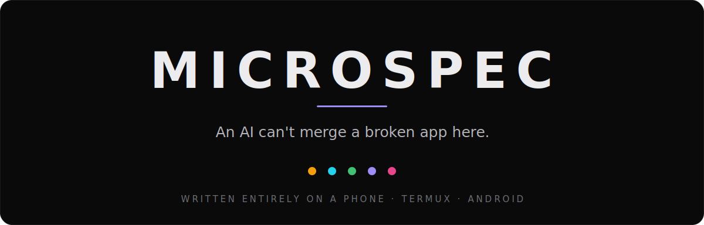
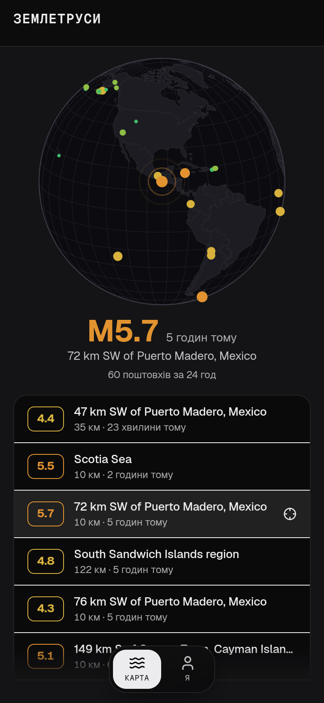
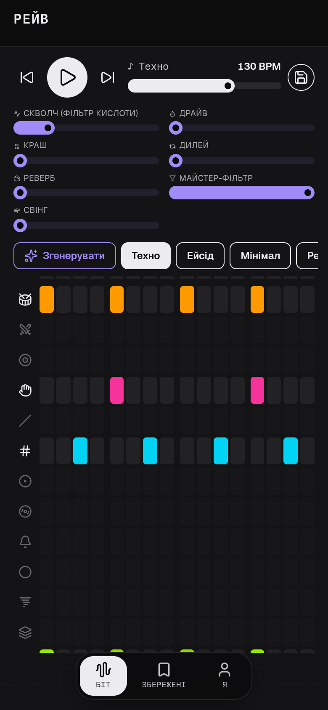
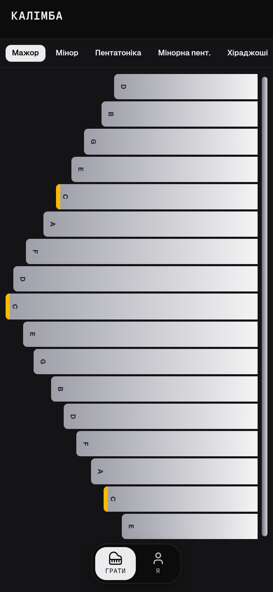
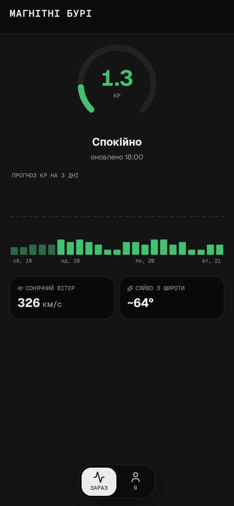
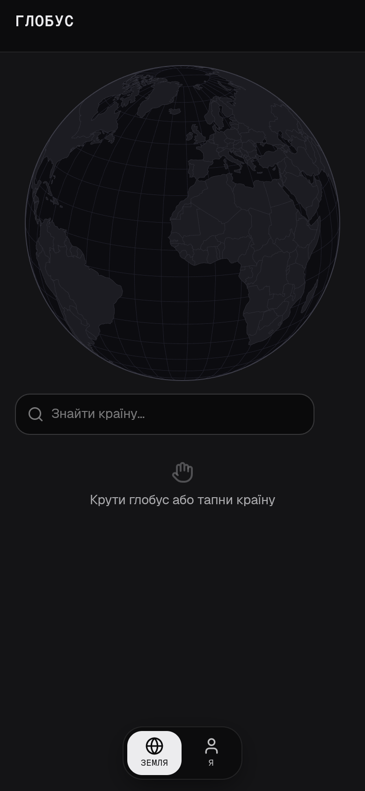
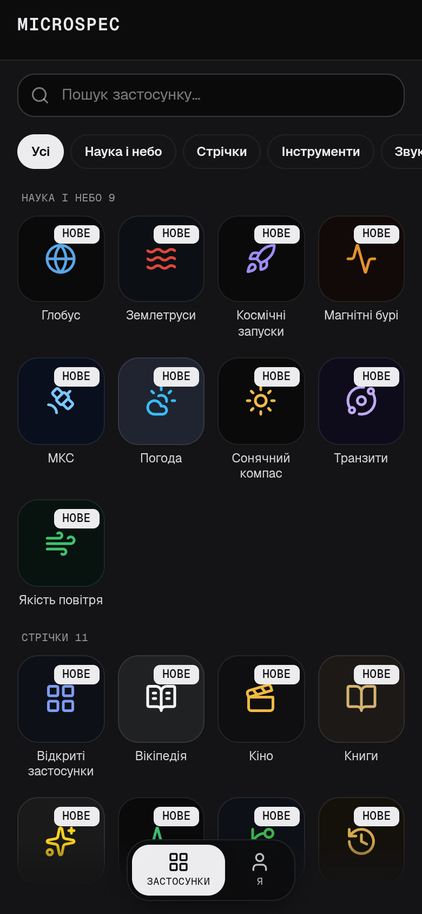

<div align="center">



<br>

[](https://github.com/damanoreshkan-beep/microspec/actions/workflows/verify.yml)
[](packages/gates/efficacy.mjs)
[](https://damanoreshkan-beep.github.io/microspec/store/)
[](#-written-on-a-phone)
[](LICENSE)

### **[▶ Open the farm — 51 installable apps](https://damanoreshkan-beep.github.io/microspec/store/)**

Add any to your home screen. They work offline. Every one is a spec + adapter that **passed the gates.**

</div>

---

<table>
<tr>
<td width="33%"><a href="https://damanoreshkan-beep.github.io/microspec/quakes/"></a><div align="center"><sub><b>Quakes</b> · live seismic globe, magnitude-coded</sub></div></td>
<td width="33%"><a href="https://damanoreshkan-beep.github.io/microspec/rave/"></a><div align="center"><sub><b>Rave</b> · a synthesised techno instrument</sub></div></td>
<td width="33%"><a href="https://damanoreshkan-beep.github.io/microspec/kalimba/"></a><div align="center"><sub><b>Kalimba</b> · a playable thumb piano</sub></div></td>
</tr>
<tr>
<td width="33%"><a href="https://damanoreshkan-beep.github.io/microspec/kp/"></a><div align="center"><sub><b>Aurora</b> · a Kp-index space-weather dashboard</sub></div></td>
<td width="33%"><a href="https://damanoreshkan-beep.github.io/microspec/globe/"></a><div align="center"><sub><b>Globe</b> · spin the world, tap a country</sub></div></td>
<td width="33%"><a href="https://damanoreshkan-beep.github.io/microspec/store/"></a><div align="center"><sub><b>The launcher</b> · every app, one home screen</sub></div></td>
</tr>
</table>

microspec is an open-source framework for **AI-authored, installable micro-PWAs.** An agent writes a thin
**spec** (+ a tiny data adapter) against a **verified runtime**, and hard **CI gates** — accessibility,
responsiveness, end-to-end behaviour, runtime-error surveillance — *block the merge* if the app is broken,
inaccessible, or untranslated. The constraint is the point: a narrow spec + a gated runtime is what makes
agent-generated apps **verifiably** correct instead of hopefully correct.

<p align="center">
  <a href="https://damanoreshkan-beep.github.io/microspec/store/">
    
  </a>
  <br><sub>The gate catching a real mistake — an agent's dropped translation — in ~2 seconds. Only green merges.</sub>
</p>

## 📱 Written on a phone

No laptop. No desktop. The runtime, the gates, and all 51 apps were written and shipped from **Termux on
Android** — on-device [Deno](https://deno.com), a phone as the whole workstation.

That constraint *shaped the toolchain*, it isn't a party trick: the heavy browser gate (Chromium + axe)
can't run on the phone, so local checks are **browser-free and fast** (contract + render integrity in ~2s),
and the real-browser matrix runs in **GitHub Actions** on every push. The split between "what a phone
verifies in a second" and "what CI verifies in a minute" is the same split the rest of this README is about.

## The problem

"Prompt → app" is now commodity — Lovable, v0, Bolt, Cursor all generate freeform code. The universal
catch: the output is often inaccessible, non-responsive, or subtly broken, and **you can't trust it
without reviewing every line.** Freeform generation has no floor.

## The idea

Give the agent a **floor it cannot fall through:**

1. **Constrain the surface.** Apps are declared as a JSON **spec** against a fixed runtime with five
   families (`list · dashboard · converter · tool · profile`) and detail / search / filters / i18n / PWA
   baked in. The agent writes structure, not a framework.
2. **Gate everything in CI.** A headless-Chromium harness runs the app in every state and **fails the
   build** on any violation. Red gate → no merge. Green gate → auto-deploy to GitHub Pages.

The 51-app farm is the proof, and doubles as the regression suite for the runtime itself.

## The gate (this is the wedge)

Every changed app is run through a real browser (Astral + Chromium + axe-core) across its **loading,
settled, and animated** states, and watched for runtime errors the whole time:

| Check | What fails the build |
|---|---|
| **Accessibility** | any axe-core violation of `critical` / `serious` impact — in **both** light & dark themes |
| **Responsive @384px** | any horizontal overflow at true phone width |
| **Glanceable @200px** | content that doesn't fit a smartwatch-width container |
| **End-to-end** | app-authored `e2e.spec.mjs` assertions (`count · click · type · back · prop · waitFor …`) |
| **Runtime errors** | any uncaught error or `console.error` during any state |
| **Render integrity** | blank render, unclosed tags, missing i18n keys, content-less spinners (browser-free `preflight`, ~2s) |

An agent that introduces an inaccessible contrast pair, an element that overflows the watch, or a view
that throws **cannot get its PR merged.** No human has to catch it.

## Measured, not claimed

"The gate catches bugs" is itself testable. [`packages/gates/efficacy.mjs`](packages/gates/efficacy.mjs)
**mutation-tests the gate**: it injects a catalog of realistic agent mistakes — a dropped translation, an
invalid spec, a banned spinner, a throwing view — into a *copy* of each app (the real tree is never
touched) and records whether the gate goes red. The score is caught / total: a number, not a promise.

| Tier | Catches | Score |
|---|---|---|
| **preflight** (browser-free, runs on the phone) | dropped translation · invalid spec · banned spinner · throwing view · locale drift · unseeded sensor mock | **100%** (60/60) |
| **verify** (Chromium, in CI) | broken data adapter · failing e2e · **inaccessible control (axe)** | **100%** |

The first run scored **79%** and surfaced a real gap — the browser-free tier wasn't enforcing locale
parity, so an app could ship an untranslated string. We added the check and re-measured. That loop —
*measure → find a gap → close it → re-measure* — now runs in CI, so a regression in the **gate itself**
fails the build.

### …and what the gates still cannot see

Measuring the gate's strength without measuring its blind spots would be marketing. The same rigour is
turned on itself in **[`docs/GATE_BLINDSPOTS.md`](docs/GATE_BLINDSPOTS.md)** — a catalogue of real defects
that shipped **with every gate green.** The pattern is always the same: *a gate verifies that a mechanism
exists; it does not ask whether the mechanism achieves its purpose.*

| The gate asks | It does not ask |
|---|---|
| Does a manifest exist? | Can a user actually install this? |
| Does text render? | Is it in the reader's language? |
| Does each state pass contrast? | Can you tell the states apart? |

That last one is the sharpest: the dock's active tab was invisible for the life of this project at a
measured **1.56:1** against its inactive siblings — because axe checks text against its *background*, never
one state against *another*. Both states passed every check. **A green gate is a floor, not a verdict.**

## Not just feeds

Depth lives in the runtime, not the apps. Habits is a stateful offline tracker (IndexedDB, streak math, a
13-week heatmap, JSON export); Rave is a real instrument; GPS Ruler measures distance/area by walking a
polyline (haversine + shoelace). Read-only catalogs are one slice.

`packages/runtime/groove.js` is four published results turned into four functions — Toussaint's Euclidean
rhythms (2005), the Longuet-Higgins & Lee syncopation measure (1984), the inverted-U of groove from
[Witek et al. (2014)](https://journals.plos.org/plosone/article?id=10.1371/journal.pone.0094446), and
harmonicity from [Bowling & Purves (2018)](https://www.pnas.org/doi/10.1073/pnas.1505768112). Rave's
**Generate** samples that space and keeps the highest-scoring bar; the unit gate asserts `bjorklund(3,8)`
**is** the Cuban tresillo and that the search beats coin-flip random on every seed — so "generated, not
random" is a test, not a bullet point. Any future music app imports it for free.

<div align="center">
  <sub><code>habits · rave · ruler · frontier · hf · hn · rates · crypto · quakes · iss · launches · transit · sun · kp · globe · kalimba · weather · books · cinema · wiki · dou · …</code></sub>
</div>

## How it works

An app is three files the agent writes — `spec.json`, `i18n/*.json`, and `data.js` — plus boilerplate the
toolkit scaffolds. A spec is declarative:

```jsonc
{
  "id": "hn", "theme": "signal",
  "translate": ["title", "desc"],
  "fav": { "key": "id" },
  "tabs": [
    { "id": "feed", "type": "list", "search": true,
      "card": { "layout": "feed", "title": "title", "body": "desc",
                "badges": [ { "field": "points", "icon": "lucide:arrow-up" } ] } },
    { "id": "me", "type": "profile" }
  ]
}
```

```js
// data.js — the only imperative part: fetch → map to the item shape the card declares.
export async function load() {
  const r = await fetch("https://hn.algolia.com/api/v1/search?tags=front_page");
  const { hits } = await r.json();
  return { items: hits.map((h) => ({ id: h.objectID, title: h.title, desc: "", points: h.points })) };
}
```

The runtime renders it — accessible, responsive, installable, i18n, history-routed — and the gates verify
it. There is **no build step:** the runtime is browser-native ESM (Preact + htm + nanostores) from a CDN
import map; styling is Tailwind + DaisyUI; the type system is the Geist superfamily.

## Layers

| Package | Role |
|---|---|
| `packages/schema` | the spec **contract** — JSON Schema (single source of truth) + ajv validator |
| `packages/runtime` | the Preact catalog that renders a spec (5 families + invariants), zero-build |
| `packages/gates` | `verify` (Chromium a11y / responsive / e2e / shots) + `preflight` (browser-free) |
| `packages/gen` | `scaffold` — spec + data → runnable app shell |
| `apps/` | the reference farm: 51 apps = family showcase + runtime regression suite |

## Quickstart

```bash
# scaffold a new app from a spec + i18n you (or an agent) authored
deno run -A packages/gen/scaffold.mjs apps/myapp

# fast, browser-free checks before you push (contract + render integrity) — these run on a phone
deno run -A packages/schema/validate.mjs apps/myapp/spec.json
deno run -A --import-map=packages/gates/preflight.importmap.json packages/gates/preflight.mjs apps/myapp

# assemble the static site (shared runtime + every app + portal)
deno run -A deploy/build.mjs
```

Full gates (Chromium) run in GitHub Actions on every push. See [`docs/AUTHORING.md`](docs/AUTHORING.md) for
the authoring loop, [`docs/TESTING.md`](docs/TESTING.md) for the gate internals, and
[`packages/schema/SCHEMA.md`](packages/schema/SCHEMA.md) for the spec reference.

## The author is pluggable (it's not an AI wrapper)

The model writes ~40 lines of JSON + a small adapter. The runtime (thousands of lines) and the gates do the
real work — and **neither calls a model.** So the *author* is swappable:

- **Claude** — writes a spec against the JSON-Schema contract (what this repo used).
- **Any other model** — nothing here is Anthropic-specific; the contract is just JSON Schema.
- **A deterministic script** — [`packages/gen/authorless.mjs`](packages/gen/authorless.mjs) turns a recipe
  (a source URL + a field map) into a complete app with **zero model calls**. The
  [**Books**](https://damanoreshkan-beep.github.io/microspec/books/) app was generated this way and passed
  the *same* a11y / responsive / e2e gates as everything else.
- **A human** — hand-write `spec.json` + `data.js`, scaffold, gate.

If a plain function can author a passing app, the LLM isn't the moat — the contract + families + gates are.

## What it is / isn't

- **Is:** an opinionated, *vertical* framework for a specific class of app — installable, offline, data/tool
  micro-PWAs in five families — where correctness is machine-enforced.
- **Isn't:** a general-purpose app builder or an autonomous code generator. The agent is a human-driven
  coding assistant (Claude Code) in the loop; the moat is the family taste + the spec contract + the gates,
  not the LLM.

## License

[MIT](LICENSE) © 2026 Daman Oreshkan. Contributions welcome — see [`CONTRIBUTING.md`](CONTRIBUTING.md).
