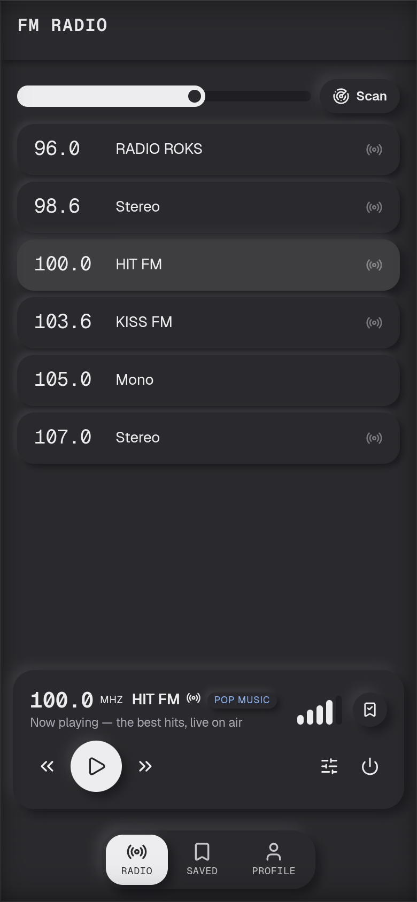
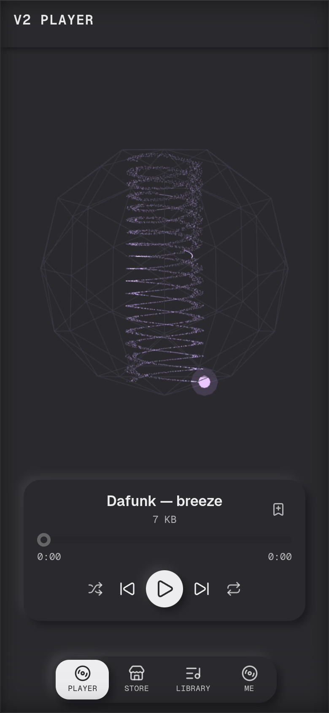
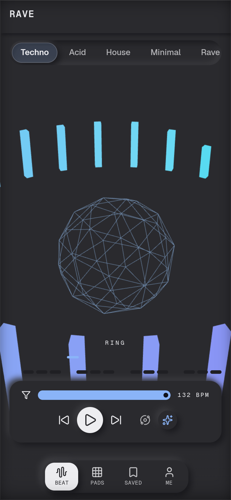
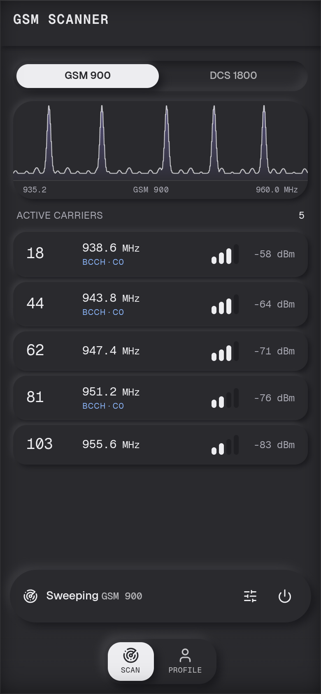
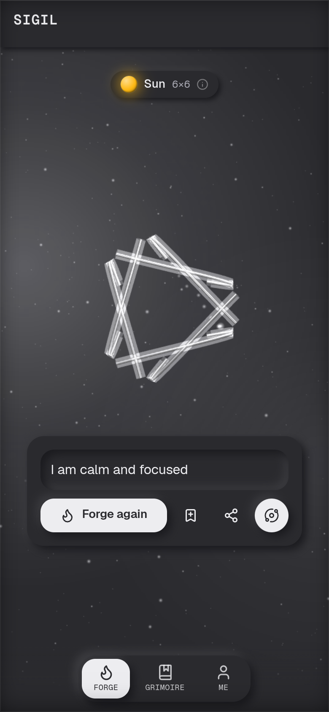
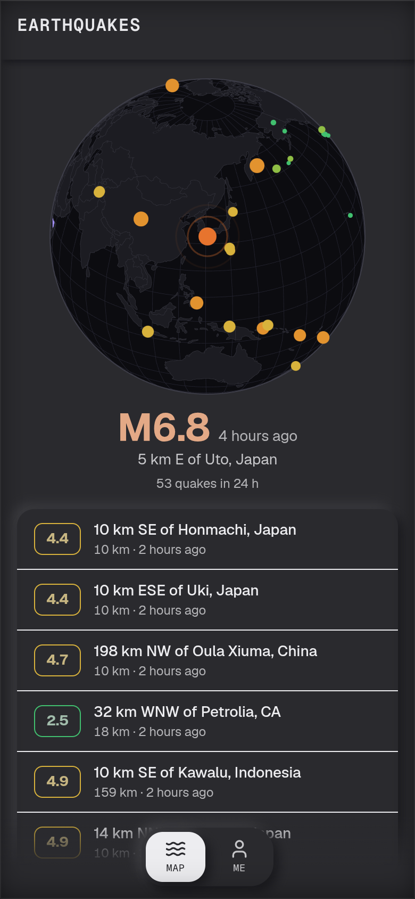
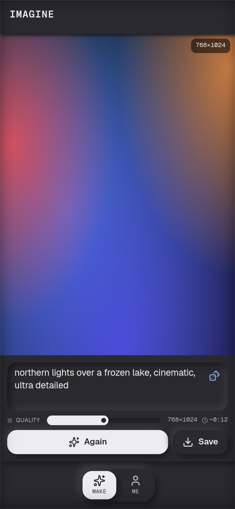

<div align="center">



<br>

[](https://github.com/damanoreshkan-beep/microspec/actions/workflows/verify.yml)
[](packages/gates/efficacy.mjs)
[](https://damanoreshkan-beep.github.io/microspec/store/)
[](#-written-on-a-phone)
[](LICENSE)

### **[▶ Open the farm — 64 installable apps](https://damanoreshkan-beep.github.io/microspec/store/)**

Add any to your home screen. They work offline. Every one is a spec + adapter that **passed the gates.**

<br>

**The stack at the root — zero `node_modules`, no build step, a CDN import map:**

[](https://deno.com)
[](https://preactjs.com)
[](https://github.com/developit/htm)
[](https://github.com/nanostores/nanostores)
[](https://tailwindcss.com)
[](https://daisyui.com)
[](https://esm.sh)
[](.github/workflows)

<sub>A **Deno workspace** is the monorepo — no Turborepo / Nx. CI verifies only the apps a change actually reaches (`tools/affected.mjs`, from the real import graph), with the toolchain cached and its install retried.</sub>

</div>

---

<table>
<tr>
<td width="33%"><a href="https://damanoreshkan-beep.github.io/microspec/fmradio/"></a><div align="center"><sub><b>FM Radio</b> · a HackRF One over WebUSB, demodulated on-device</sub></div></td>
<td width="33%"><a href="https://damanoreshkan-beep.github.io/microspec/v2m/"></a><div align="center"><sub><b>V2 Player</b> · an 87 KB WASM synth, one point per byte</sub></div></td>
<td width="33%"><a href="https://damanoreshkan-beep.github.io/microspec/rave/"></a><div align="center"><sub><b>Rave</b> · a synthesised techno instrument</sub></div></td>
</tr>
<tr>
<td width="33%"><a href="https://damanoreshkan-beep.github.io/microspec/handpan/"></a><div align="center"><sub><b>Handpan</b> · struck tone fields, lit by the gyroscope</sub></div></td>
<td width="33%"><a href="https://damanoreshkan-beep.github.io/microspec/gsmscan/"></a><div align="center"><sub><b>GSM Scanner</b> · sweep a band, list its carriers</sub></div></td>
<td width="33%"><a href="https://damanoreshkan-beep.github.io/microspec/sigil/"></a><div align="center"><sub><b>Sigil</b> · an intent walked across a kamea</sub></div></td>
</tr>
<tr>
<td width="33%"><a href="https://damanoreshkan-beep.github.io/microspec/quakes/"></a><div align="center"><sub><b>Quakes</b> · live seismic globe, magnitude-coded</sub></div></td>
<td width="33%"><a href="https://damanoreshkan-beep.github.io/microspec/imagine/"></a><div align="center"><sub><b>Imagine</b> · a wallpaper at your screen's exact ratio</sub></div></td>
<td width="33%"><a href="https://damanoreshkan-beep.github.io/microspec/store/"></a><div align="center"><sub><b>The launcher</b> · every app, one home screen</sub></div></td>
</tr>
</table>

microspec is an open-source framework for **AI-authored, installable micro-PWAs.** An agent writes a
**spec** (+ an adapter) against a **verified runtime**, and hard **CI gates** — accessibility,
responsiveness across a real device matrix, end-to-end behaviour, runtime-error surveillance — *stop the
change* if the app is broken, inaccessible, or untranslated. The constraint is the point: a narrow contract
+ a gated runtime is what makes agent-generated apps **verifiably** correct instead of hopefully correct.

<p align="center">
  <a href="https://damanoreshkan-beep.github.io/microspec/store/">
    
  </a>
  <br><sub>The gate catching a real mistake — an agent's dropped translation — in ~2 seconds. Only green ships.</sub>
</p>

## 📱 Written on a phone

No laptop. No desktop. The runtime, the gates, and all 64 apps were written and shipped from **Termux on
Android** — on-device [Deno](https://deno.com), a phone as the whole workstation.

That constraint *shaped the toolchain*, it isn't a party trick: the heavy browser gate (Chromium + axe)
can't run on the phone, so local checks are **browser-free and fast** (contract + render integrity in ~2s),
and the real-browser matrix runs in **GitHub Actions** on every push. The split between "what a phone
verifies in a second" and "what CI verifies in a minute" is the same split the rest of this README is about.

It shows up in odd places. There is no local Chromium to take a screenshot with, so design review runs off a
remote render service (`packages/gates/shoot.mjs`) — and the runtime grew `?theme=` and `?locale=` URL
overrides for exactly one reason: to make the *other* theme and the *other* language photographable by a
machine that isn't yours.

## The problem

"Prompt → app" is now commodity — Lovable, v0, Bolt, Cursor all generate freeform code. The universal
catch: the output is often inaccessible, non-responsive, or subtly broken, and **you can't trust it
without reviewing every line.** Freeform generation has no floor.

## The idea

Give the agent a **floor it cannot fall through:**

1. **Constrain the surface.** Apps are declared as a JSON **spec** against a fixed runtime with five
   families (`list · dashboard · converter · tool · profile`), detail / search / filters / i18n / PWA baked
   in, and a **systemic capability** for anything harder — camera, sensors, audio, gestures, WebUSB, offline
   storage, background playback. The agent declares structure and reaches for a capability; it does not
   write a framework, and it does not hand-roll a bottom sheet or a play button (the gate rejects both).
2. **Gate everything in CI.** A headless-Chromium harness runs the app in every state, at every viewport it
   claims to support, and **fails the build** on any violation. Red gate → nothing ships. Green gate →
   auto-deploy to GitHub Pages.

The 64-app farm is the proof, and doubles as the regression suite for the runtime itself.

## The gate (this is the wedge)

Every changed app is run through a real browser (Astral + Chromium + axe-core) across its **loading,
settled, and animated** states, and watched for runtime errors the whole time:

| Check | What fails the build |
|---|---|
| **Accessibility** | any axe-core violation of `critical` / `serious` impact — in **both** light & dark themes, on **every** tab |
| **The viewport matrix** | horizontal overflow, clipped content, or a control under the dock at any of the eight sizes below |
| **Installability** | a manifest that doesn't parse or declare an installable `display`; a service worker that never activates; a precache that doesn't hold the document |
| **End-to-end** | app-authored `e2e.spec.mjs` assertions (`count · click · type · back · prop · waitFor …`) |
| **Runtime errors** | any uncaught error or `console.error` during any state |
| **Touch feedback** | a farm-wide invariant, checked on every app rather than left to one app's e2e |
| **Render integrity** | blank render, unclosed tags, missing i18n keys, locale-parity drift, content-less spinners, a sensor app that rendered its empty waiting state (browser-free `preflight`, ~2s) |
| **Systemic adoption** | a hand-rolled sheet or play/pause control, an app-authored `box-shadow`, glass over one of our own surfaces, an emoji anywhere (`preflight`) |

### Eight viewports, not two

"Responsive" used to mean 384px. It now means a matrix of real screens, each of which breaks something
different:

| | | |
|---|---|---|
| `phone-sm` 320×568 — the small-phone floor | `phone` 384×832 — the reference | `phone-tall` 412×915 |
| `phone-land` 844×390 — the height test | `split` 412×430 — two apps stacked | `split-sm` 360×340 — a floating window |
| `tablet` 768×1024 | `tablet-land` 1024×768 | `desktop` 1280×900 |

Below the small-phone floor the runtime doesn't shrink the phone layout — it changes shape (the density
ladder steps down, side-by-side panels become a scroll-snap pager). See
[docs/research/adaptive-scale.md](docs/research/adaptive-scale.md) for which mechanism answers which
question — media query, container query, or `svh`.

An agent that introduces an inaccessible contrast pair, an element that overflows the phone, or a view that
throws **cannot get its change onto the site.** No human has to catch it.

## Measured, not claimed

"The gate catches bugs" is itself testable. [`packages/gates/efficacy.mjs`](packages/gates/efficacy.mjs)
**mutation-tests the gate**: it injects a catalog of realistic agent mistakes into a *copy* of each app (the
real tree is never touched) and records whether the gate goes red. The score is caught / total: a number,
not a promise.

| Tier | Catches | Score |
|---|---|---|
| **preflight** (browser-free, runs on the phone) | dropped spec label · dropped `en` fallback · dropped runtime key · locale-blind date · two classes of invalid spec · banned spinner · throwing view · unseeded sensor mock | **100%** (60/60) |
| **verify** (Chromium, in CI) | broken data adapter · stripped card badges (e2e) · **empty accessible tab names (axe)** | **100%** |

The first run scored **79%** and surfaced a real gap — the browser-free tier wasn't enforcing locale
parity, so an app could ship an untranslated string. We added the check and re-measured. That loop —
*measure → find a gap → close it → re-measure* — now runs in CI, so a regression in the **gate itself**
fails the build.

### …and what the gates still cannot see

Measuring the gate's strength without measuring its blind spots would be marketing. The same rigour is
turned on itself in **[`docs/GATE_BLINDSPOTS.md`](docs/GATE_BLINDSPOTS.md)** — a catalogue of twelve real
defects that shipped **with every gate green.** The pattern is always the same: *a gate verifies that a
mechanism exists; it does not ask whether the mechanism achieves its purpose.*

| The gate asked | It did not ask |
|---|---|
| Does a manifest exist? | Can a user actually install this? |
| Does text render? | Is it in the reader's language? |
| Does each state pass contrast? | Can you tell the states apart? |

That last one is the sharpest: the dock's active tab was invisible for the life of this project at a
measured **1.56:1** against its inactive siblings — because axe checks text against its *background*, never
one state against *another*. Both states passed every check.

Most of the catalogue is now closed — installability and service-worker activation are *gated*, so those
cannot regress. The dock one was closed a weaker way, and it is worth being precise about: the active tab is
now a filled ink pill at 16.6:1, a **shape** rather than a luminance step. No gate compares one state to
another; the design stopped needing one. Some entries are marked **OPEN** and stay that way honestly:
`preflight` mounts only
the first tab; headless Chromium has no XR device and no radio, so those code paths have no floor under
them; a cold offline launch on a real device is still the only full proof of the cross-origin precache.
**A green gate is a floor, not a verdict.**

## Not just feeds

Depth lives in the runtime, not the apps — 81 modules and ~9k lines of it, held by a 3.9k-line unit suite,
each module shared by every app that asks for it. Read-only catalogs are one slice, and no longer the interesting one.

**Radio, from a browser tab.** [`packages/runtime/hackrf.js`](packages/runtime/hackrf.js) drives a HackRF
One directly over **WebUSB** (`0x1d50:0x6089`, 256 KiB bulk transfers, RX *and* TX) with no driver, no
native app and no install. Four apps sit on it: **FM Radio** demodulates broadcast FM with RDS station text
and an auto-scan; **GSM Scanner** sweeps the ARFCN grid at 200 kHz spacing; **LoRa Watch** dechirps and
decodes Meshtastic/LoRaWAN packets under a live waterfall; **Remote Cloner** captures a fixed-code OOK
remote at 433.92/315/868 MHz and replays it. Each has a primary-source research note
([FM](docs/research/hackrf-webusb-fm.md) · [RDS](docs/research/rds-and-scan.md) ·
[GSM](docs/research/gsm-band-scanner.md) · [LoRa](docs/research/lora-detect.md) ·
[OOK](docs/research/subghz-ook-clone.md)) written *before* the code.

**A demoscene synthesiser, unmodified.** **V2 Player** ships Farbrausch's V2 as an **87 KB** WebAssembly
module rendered in an AudioWorklet, streaming a live archive of **347 tunes by 81 authors** (median 50 KB —
a four-minute track in the space 3 seconds of MP3 would take, roughly **75× smaller** than the same music
encoded). The hero puts one point per file byte on a Fibonacci helix, so the visual *is* the file.

**Music mathematics, as a library.** [`packages/runtime/groove.js`](packages/runtime/groove.js) is four
published results turned into four functions — Toussaint's Euclidean rhythms (2005), the Longuet-Higgins &
Lee syncopation measure (1984), the inverted-U of groove from
[Witek et al. (2014)](https://journals.plos.org/plosone/article?id=10.1371/journal.pone.0094446), and
harmonicity from [Bowling & Purves (2018)](https://www.pnas.org/doi/10.1073/pnas.1505768112). Rave's
**Generate** samples that space and keeps the highest-scoring bar; the unit gate asserts `bjorklund(3,8)`
**is** the Cuban tresillo and that the search beats coin-flip random on every seed — so "generated, not
random" is a test, not a bullet point. `melody.js` scores melodic search for Kalimba and Handpan;
`ambient.js` does consonance, voice-leading and near-coprime Eno loops for Drift's endless mix. Any future
music app imports all of it for free.

**And the rest.** Habits is a stateful offline tracker (IndexedDB, streak math, a 13-week heatmap, JSON
export); GPS Ruler measures distance and area by walking a polyline (haversine + shoelace); Transits does
Placidus houses and exact-aspect root finding over historical timezones; Compass, Sun and Flux read real
sensors (Pendulum simulates one — the oscillation is closed-form and unit-tested); Camera, QR and Pipette use the device; APK Forge turns any URL into a signed,
sideloadable Android APK.

<div align="center">
  <sub><code>fmradio · gsmscan · lorawatch · subclone · v2m · rave · drift · handpan · kalimba · sopilka · sigil · imagine · retouch · habits · ruler · pendulum · compass · flux · cam · qr · pipette · apkforge · transit · tarot · quakes · iss · launches · kp · globe · sun · weather · air · hn · hf · wiki · books · cinema · rates · crypto · …</code></sub>
</div>

## How it works

An app is a `spec.json`, an `i18n/en.json` + `i18n/uk.json` pair, and **one adapter** — `data.js` for a feed,
`view.js` for a tool, `stream.js` for a live source. The toolkit scaffolds the rest. A spec is declarative:

```jsonc
{
  "id": "hn", "theme": "signal",
  "translate": ["title", "desc"],
  "fav": { "key": "id" },
  "tabs": [
    { "id": "feed", "type": "list", "search": true,
      "card": { "layout": "feed", "title": "title", "body": "desc",
                "badges": [ { "field": "points", "icon": "lucide:arrow-up" } ] } },
    { "id": "me", "type": "profile" }
  ]
}
```

```js
// data.js — for a feed app, the only imperative part: fetch → map to the item shape the card declares.
export async function load() {
  const r = await fetch("https://hn.algolia.com/api/v1/search?tags=front_page");
  const { hits } = await r.json();
  return { items: hits.map((h) => ({ id: h.objectID, title: h.title, desc: "", points: h.points })) };
}
```

The runtime renders it — accessible, responsive, installable, i18n, history-routed — and the gates verify
it. A tool app writes a `view.js` instead and gets the same chrome, the same routing and the same gates; the
heavy ones add a worker, a WebGL scene, or an `e2e.spec.mjs`. There is **no build step for app or runtime
code:** it is browser-native ESM (Preact + htm + nanostores) from a CDN import map, styled with Tailwind +
DaisyUI, set in the Geist superfamily. Deployment assembles `dist/` and generates icons and precache
manifests, but nothing is bundled or transpiled.

### The design system is enforced, not documented

A style guide an agent can ignore is a style guide that drifts. So the material is systemic and the gate
owns it: every interactive node declares **what it is** — `sf-raised` / `sf-inset` / `sf-pressed`, or a rung
of a five-step elevation ladder — and an app-authored `box-shadow` fails `preflight`. One light source at
45°, a near-symmetric shadow pair asserted in **both** themes by unit test, and a `--ms-*` density ladder
that steps with the screen.

The corollary is the one rule this project keeps relearning: **a number that describes an element must be
measured from it.** `--hdr-h` and `--dock-h` are published by the chrome that owns them, and a unit test
fails any media query that re-declares one — because a hand-written `4.25rem` is correct right up until the
element moves, and then it silently puts content under the bar. See
[docs/research/surface-system.md](docs/research/surface-system.md) and
[docs/research/neumorphism-migration.md](docs/research/neumorphism-migration.md).

### Offline is a property of the runtime, not of each app

No build step means an app's own *code* is cross-origin — preact/htm/nanostores on esm.sh, Tailwind and
DaisyUI on jsDelivr, the icon element, the fonts. So "works offline" cannot mean "caches its own folder":
`packages/runtime/sw-core.js` is one service worker, shared by every app, that precaches the app's **whole
shell** at install — its files, the `/_rt/` modules its import graph actually reaches, and the pinned CDN
URLs behind them (module-walked, because an esm.sh entry URL is a re-export stub, not the code). Each app's
`sw.js` is a generated stub carrying only that manifest, derived from the real import graph by
`deploy/sw.mjs` and gated in CI. Serving is **stale-while-revalidate**: the cache answers immediately and
the refresh happens behind it, so an unplugged network and a 2G one take the same instant path, and a newer
build lands on the next launch (or right away, if you take the restart the app offers). See
[docs/research/offline-first-sw.md](docs/research/offline-first-sw.md) for the four defects this replaced.

## Research before code

Twenty-six research notes — [14 systemic](docs/research/) plus one per hard app — sit in the repo as
first-class artifacts. Each records the primary sources, the numbers and formulas the build will use, the
approaches considered *and rejected*, and what verification would have to show. They exist because the
alternative is the failure mode this project is built to avoid: one hypothesis, one push, one CI round,
repeat. A note costs an hour; a wrong hypothesis costs a day of red builds and still doesn't teach you
anything.

## Layers

| Package | Role |
|---|---|
| `packages/schema` | the spec **contract** — JSON Schema (single source of truth) + ajv validator |
| `packages/runtime` | 81 zero-build modules: the 5 families, the UI kit, the design tokens, and the systemic capabilities (sensors · camera · audio · WebUSB · storage · i18n · offline) |
| `packages/gates` | `verify` (Chromium: a11y / viewport matrix / installability / e2e / shots) + `preflight` (browser-free) + `efficacy` (mutation-tests the gates) + `shoot` (remote stills for design review) |
| `packages/gen` | `scaffold` — spec + adapter → runnable app shell |
| `apps/` | the reference farm: 64 apps = family showcase + runtime regression suite |

## Quickstart

```bash
# scaffold a new app from a spec + i18n you (or an agent) authored
deno run -A packages/gen/scaffold.mjs apps/myapp

# the full local gate — the 8n8 `gates` flow: ten independent nodes, run concurrently, every failure
# reported in one round. Runs on a phone, ~16s warm (the old sequential chain took 45s).
deno task gates

# the pipeline itself: every node, script vs agent hand-off, and how much of it no longer needs a model
deno task 8n8 --list

# which apps does my change actually reach? (the same graph CI uses)
deno task affected

# assemble the static site (shared runtime + every app + portal)
deno run -A deploy/build.mjs

# after a push: read the failures from the last CI run, in full, with their offending elements
deno task red
```

Full gates (Chromium) run in GitHub Actions on every push, and deployment is gated on them — a red `main`
never reaches the site. See [`docs/AUTHORING.md`](docs/AUTHORING.md) for the authoring loop,
[`docs/TESTING.md`](docs/TESTING.md) for the gate internals,
[`docs/DESIGN_RUBRIC.md`](docs/DESIGN_RUBRIC.md) for the taste review, and
[`packages/schema/SCHEMA.md`](packages/schema/SCHEMA.md) for the spec reference.

## The author is pluggable (it's not an AI wrapper)

The model writes a spec and an adapter. The runtime and the gates do the real work — and **the authoring and
verification path calls no model at all.** So the *author* is swappable:

- **Claude** — writes a spec against the JSON-Schema contract (what this repo used).
- **Any other model** — nothing here is Anthropic-specific; the contract is just JSON Schema.
- **A deterministic script** — [`packages/gen/authorless.mjs`](packages/gen/authorless.mjs) turns a recipe
  (a source URL + a field map) into a complete app with **zero model calls**. The
  [**Books**](https://damanoreshkan-beep.github.io/microspec/books/) app was generated this way and passed
  the *same* a11y / responsive / e2e gates as everything else.
- **A human** — hand-write `spec.json` + an adapter, scaffold, gate.

If a plain function can author a passing app, the LLM isn't the moat — the contract + families + gates are.

A few *apps* do call a model at runtime (Imagine and Retouch generate and edit images; Tarot and Transits
can synthesise a reading), through [`packages/runtime/ai.js`](packages/runtime/ai.js) and a small private
edge service that holds the key. That is a **capability an app may request**, like the camera — it is
fail-open (a miss returns the input, the app stays usable), and it is nowhere near the path that authors or
verifies an app.

## What it is / isn't

- **Is:** an opinionated, *vertical* framework for a specific class of app — installable, offline, data /
  tool / instrument micro-PWAs — where correctness is machine-enforced.
- **Isn't:** a general-purpose app builder or an autonomous code generator. The agent is a human-driven
  coding assistant in the loop; the moat is the family taste + the spec contract + the gates, not the LLM.

## License

[MIT](LICENSE) © 2026 Daman Oreshkan. Contributions welcome — see [`CONTRIBUTING.md`](CONTRIBUTING.md).
