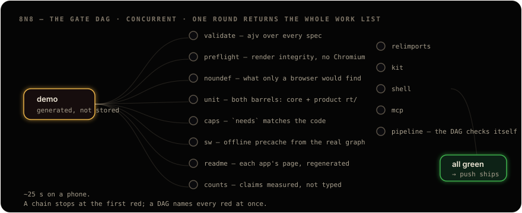

<div align="center">


<br>

[](https://jsr.io/@microspec/core)
[](https://jsr.io/@microspec/core/score)
[](https://github.com/damanoreshkan-beep/microspec/actions/workflows/verify.yml)
[](packages/gates/efficacy.mjs)
[](https://dreamstudio.mooo.com/store/)
[](#written-on-a-phone)
[](LICENSE)

### The appless core for AI-authored, installable micro-PWAs.

A JSON **spec contract**, a **verified zero-build runtime**, and **CI gates** that stop a broken app from
shipping. This repo carries **no apps at all** — not even a demo: the app its CI verifies is *generated*
on the spot (`deno task demo`, a deterministic recipe, zero model calls) and walks the same gates as
everything a product ships. The first product built on it is **[DreamStudio](https://github.com/damanoreshkan-beep/dreamstudio)**.

**It is a package: [`@microspec/core` on JSR](https://jsr.io/@microspec/core)** — documented module by module,
every export typed, published from CI with provenance.

```sh
deno add jsr:@microspec/core          # the runtime, schema, gates and tools — execution rides jsr:
```
```json
{ "dependencies": { "@microspec/core": "npm:@jsr/microspec__core@1.0.8" } }   # the FILES (css, sprites) via JSR's npm-compat, for /_rt serving and the build
```

<br>

[](https://deno.com)
[](https://preactjs.com)
[](https://github.com/developit/htm)
[](https://github.com/nanostores/nanostores)
[](https://tailwindcss.com)
[](https://daisyui.com)
[](https://esm.sh)
[](.github/workflows)

<sub>A **Deno workspace** is the whole monorepo — no Turborepo / Nx, no `node_modules`, no build step.
CI verifies only what a change actually reaches (`tools/affected.mjs`, from the real import graph).</sub>

</div>

---

<div align="center">

</div>

"Prompt → app" is commodity — and the output of freeform generation is routinely inaccessible,
non-responsive, or subtly broken. **Freeform generation has no floor.** This core is the floor:

1. **Constrain the surface.** An app is a declarative **spec** against a fixed runtime — five tab families
   (`list · dashboard · converter · tool · profile`), detail / search / filters / i18n / PWA baked in, and
   a **systemic capability** for anything harder: camera, sensors, audio, gestures, WebUSB, storage,
   background playback, AI. The author declares structure; it never hand-rolls a sheet or a play button
   (the gate rejects both).
2. **Gate everything.** A headless-Chromium harness runs the app in every state, at every viewport it
   claims, in both themes — and **fails the build** on any violation. Red gate → nothing ships.

## The gate (this is the wedge)

| Check | What fails the build |
|---|---|
| **Accessibility** | any axe-core violation of `critical` / `serious` impact — **both** themes, **every** tab |
| **The viewport matrix** | horizontal overflow, clipped content, or a control under the dock at any of eight real screen shapes — from a 320px phone to a 360×340 floating window to desktop |
| **Installability** | a manifest that doesn't parse; a service worker that never activates; a precache that doesn't hold the shell |
| **End-to-end** | the app's own `e2e.spec.mjs` assertions (`count · click · type · back · prop · waitFor …`) |
| **Runtime errors** | any uncaught error or `console.error`, in any state, the whole session |
| **Render integrity** | blank render, missing i18n keys, locale-parity drift, content-less spinners, an unseeded sensor screen — browser-free `preflight`, ~2 s |
| **Systemic adoption** | a hand-rolled sheet or transport, an app-authored `box-shadow`, sideways-shifted chrome decor, an emoji anywhere |

<p align="center">
  
  <br><sub>The gate catching a real mistake — a dropped translation — in ~2 seconds. Only green ships.</sub>
</p>

## One round returns the whole work list

The local gates are not a script chain — they are a **DAG** (`tools/8n8/`): a chain stops at the first
red and hides the next four failures behind it; the DAG runs every independent node concurrently and
names **every** red at once, with its offending element and geometry. The same registry measures itself:
every node is either a deterministic `script` or still an `agent` hand-off, and the share that no longer
needs a model only goes up.

<div align="center">

</div>

The `demo` node is the interesting one: since the core carries no apps, it **generates** its gate material —
`authorless.mjs` turns a recipe (a source URL + a field map) into a complete app with **zero model calls**,
`scaffold` gives it a shell, and the whole DAG then judges it like any product app. The generator passing
its own gates is the existence proof that the author is pluggable.

## The core does not know the product

<div align="center">

</div>

The runtime here holds only **systemic** modules — device capabilities, audio and viz engines, the UI kit,
the design tokens, extraction and i18n machinery. A product keeps its **domain** modules (its own theory,
drivers, content) in its own `rt/` and installs this repo as **[`@microspec/core` on JSR](https://jsr.io/@microspec/core)** —
a real package at one exact version: the tarball materializes the runtime files for `/_rt` serving, the
tools run straight off the registry. Same barrel, same gates, same floor — different owners.

| Layer | Role |
|---|---|
| `packages/schema` | the spec **contract** — JSON Schema (single source of truth) + ajv validator |
| `packages/runtime` | 68 zero-build core modules: the five families, the UI kit, the design tokens, the systemic capabilities |
| `packages/gates` | `verify` (Chromium: a11y / matrix / e2e) · `preflight` (browser-free) · `efficacy` (mutation-tests the gates) · `dist-eye` (measures the BUILT pages) |
| `packages/gen` | `scaffold` (spec + adapter → runnable shell) · `authorless` (recipe → app, no model) |
| `tools/8n8` | the pipeline registry — the DAG, its runner, and the determinism measurement |
| `apps/` | **empty in git** — the demo is generated (`deno task demo`) |

## Measured, not claimed

"The gate catches bugs" is itself testable. [`packages/gates/efficacy.mjs`](packages/gates/efficacy.mjs)
**mutation-tests the gate**: it injects a catalog of realistic authoring mistakes into a *copy* of an app
and records whether the gate goes red. The score is caught / total — a number, not a promise — and it runs
in CI, so a regression in the **gate itself** fails the build. The same rigour is turned on the blind spots:
[`docs/GATE_BLINDSPOTS.md`](docs/GATE_BLINDSPOTS.md) catalogues the real defects that once shipped with
every gate green, and which of them are now gated shut. **A green gate is a floor, not a verdict.**

## The design system is enforced, not documented

A style guide an agent can ignore is a style guide that drifts. The material is systemic and the gate owns
it: every surface declares what it is, an app-authored `box-shadow` fails `preflight`, the theme's colour
poles are asserted as *text* in both themes by unit test, and the chrome publishes its own measured heights
(`--hdr-h`, `--dock-h`) — a hand-written constant beside a moving element is a bug with a delay fuse, so a
test forbids re-declaring them. Offline is the runtime's property, not each app's: one shared service
worker precaches an app's whole shell from its **real import graph**, regenerated and gated on every push.

## Quickstart

```bash
# generate the demo app (the repo ships none — the core does not know the product)
deno task demo

# scaffold a new app from a spec + i18n you (or an agent) authored
deno run -A packages/gen/scaffold.mjs apps/myapp

# the full local gate — the 8n8 DAG, concurrent, every failure reported in one round (~25 s on a phone)
deno task gates

# the pipeline itself: every node, script vs agent hand-off, and how much no longer needs a model
deno task 8n8 --list

# which apps does my change actually reach? (the same graph CI uses)
deno task affected

# assemble the static site
deno run -A deploy/build.mjs
```

See [`docs/AUTHORING.md`](docs/AUTHORING.md) for the authoring loop, [`docs/TESTING.md`](docs/TESTING.md)
for the gate internals, [`docs/DESIGN_RUBRIC.md`](docs/DESIGN_RUBRIC.md) for the taste review, and
[`packages/schema/SCHEMA.md`](packages/schema/SCHEMA.md) for the spec reference.

## The author is pluggable

The model writes a spec and an adapter; the runtime and the gates do the real work — and the verification
path calls **no model at all**. So the author is swappable: **Claude**, **any other model** (the contract
is just JSON Schema), **a deterministic script** (`authorless.mjs` — the generated demo this CI verifies),
or **a human**. If a plain function can author a passing app, the LLM isn't the moat — the contract, the
families and the gates are.

## Written on a phone

No laptop. The runtime, the gates and the products built on them were written and shipped from **Termux on
Android** — on-device Deno, a phone as the whole workstation. The constraint shaped the toolchain: local
checks are browser-free and fast (~2 s), the real-browser matrix runs in CI, and the runtime grew `?theme=`
/ `?locale=` URL overrides for exactly one reason — to make the other theme and the other language
photographable by a machine that isn't yours.

## License

[MIT](LICENSE) © 2026 Daman Oreshkan. Contributions welcome — see [`CONTRIBUTING.md`](CONTRIBUTING.md).
