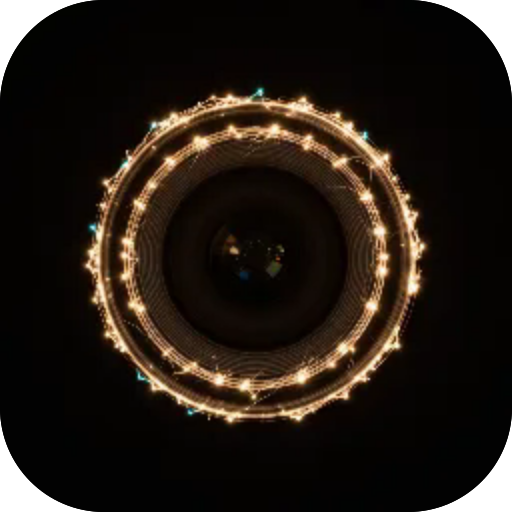

# Камера

**Кишенькова камера-консоль, напхана налаштуваннями — фільтри, експозиція, зум, ліхтарик, таймер, сітка, дзеркало, передня/задня та кадр 1:1 / 4:3 / повний — за одним квадратним видошукачем і великою кнопкою затвора. Знімки лишаються на пристрої, нічого не вивантажується.**

  

---

**Screens** Кадр  ·  **Capabilities** —  ·  **Offline** yes  ·  **Installable** yes

Part of the **[microspec farm](../../)** — an AI-authored, gated micro-PWA. Every screen is accessible,
responsive, installable and offline by construction. Browse the whole set from the **[store](../store/)**.

Generated from `spec.json` + `i18n/` by `deploy/readme.mjs` — edit the app, not this file.
