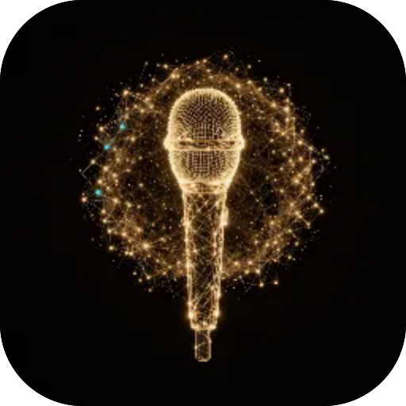

# Зерно

**Запиши дві секунди світу — двері, чашку, дощ, власний голос — і грай ним. Зерно ріже запис на короткі зерна у вікні Ганна й повертає їх хмарою, яку ти вдаряєш на восьми полях у своєму ладі: коренем є сам запис, тож безтоновий удар працює як чаша і йому ніколи не приписують ноту, якої немає. Нахил гне розмір зерна й тон, Потік пише фразу, а почуте експортується у WAV. Запис і обробка на твоєму пристрої, офлайн.**

  

---

**Screens** Гра · Форма · Записи  ·  **Capabilities** —  ·  **Offline** yes  ·  **Installable** yes

Part of the **[microspec farm](../../)** — an AI-authored, gated micro-PWA. Every screen is accessible,
responsive, installable and offline by construction. Browse the whole set from the **[store](../store/)**.

Generated from `spec.json` + `i18n/` by `deploy/readme.mjs` — edit the app, not this file.
