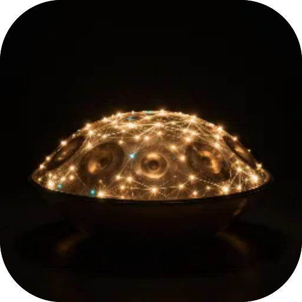
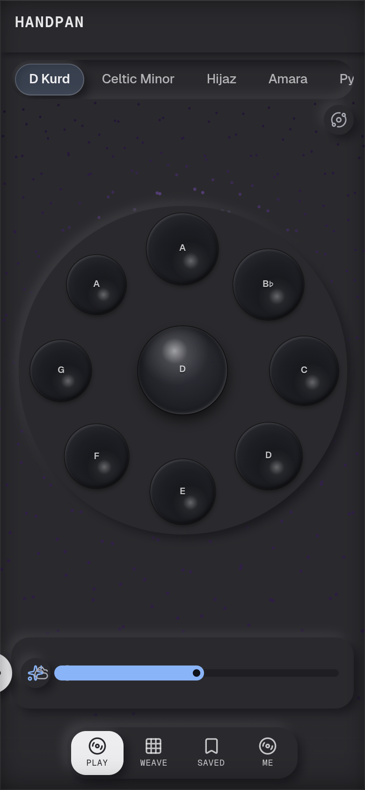

# Хендпан

**Хендпан, на якому можна грати: удар по тон-полю дає солодкий гармонічний дзвін 1:2:3 (основна, октава, дуодецима), 10 налаштованих строїв і 5 голосів, Потік автоматично генерує медитативну лінію (науково обґрунтований мелодичний пошук — консонанс, голосоведення, розв'язання), запиши власні лупи ударами й тчи їх на сітці. Синтез наживо, без семплів, офлайн.**

  

 

---

**Screens** Гра · Ткання · Збережені  ·  **Capabilities** —  ·  **Offline** yes  ·  **Installable** yes

Part of the **[microspec farm](../../)** — an AI-authored, gated micro-PWA. Every screen is accessible,
responsive, installable and offline by construction. Browse the whole set from the **[store](../store/)**.

Generated from `spec.json` + `i18n/` by `deploy/readme.mjs` — edit the app, not this file.
