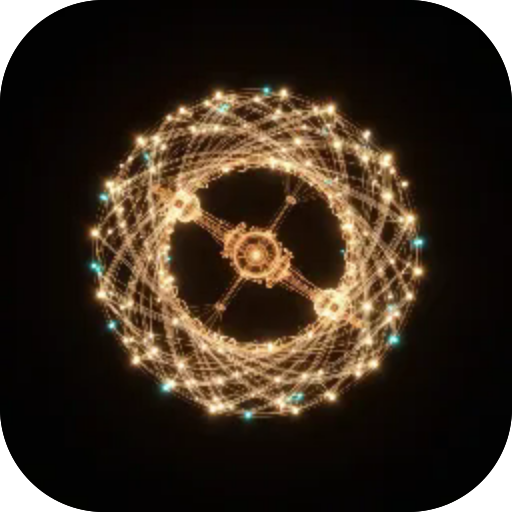

# Аванпости і станції

**Програмний генератор саундскейпів космічних станцій для фокусу та сну. Ступи на реакторне ядро, командний місток, кріовідсік чи покинутий фрахтовик — гул корпусу, вентиляція, розстроєний дрон реактора, сервоприводи, телеметрія й сигнал далекого космосу синтезуються наживо з рівномірно-темперованих строїв, без файлів, офлайн. Шість макро-фейдерів формують мікс; станції плавно перетікають одна в одну.**

  

---

**Screens** Генератор  ·  **Capabilities** —  ·  **Offline** yes  ·  **Installable** yes

Part of the **[microspec farm](../../)** — an AI-authored, gated micro-PWA. Every screen is accessible,
responsive, installable and offline by construction. Browse the whole set from the **[store](../store/)**.

Generated from `spec.json` + `i18n/` by `deploy/readme.mjs` — edit the app, not this file.
