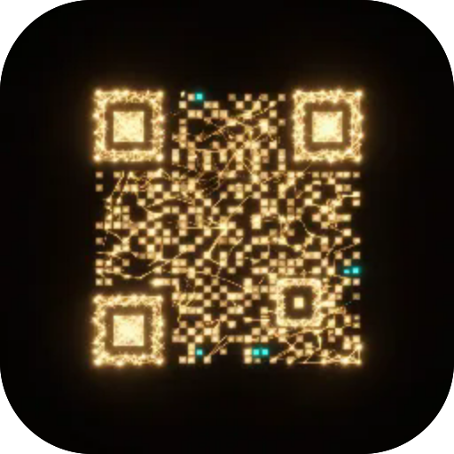

# QR-сканер

**Скануй QR і бач, куди веде посилання — хост, повний URL і вердикт безпеки — ще до того, як тапнеш. Ловить прийоми квішингу: скорочені посилання, схожі (гомографні) домени, приховані справжні хости, незахищені коди й коди, що виконують дію. Задня камера, на пристрої, офлайн; працює з нативним сканером або вбудованим резервним.**

  

---

**Screens** Скан  ·  **Capabilities** —  ·  **Offline** yes  ·  **Installable** yes

Part of the **[microspec farm](../../)** — an AI-authored, gated micro-PWA. Every screen is accessible,
responsive, installable and offline by construction. Browse the whole set from the **[store](../store/)**.

Generated from `spec.json` + `i18n/` by `deploy/readme.mjs` — edit the app, not this file.
