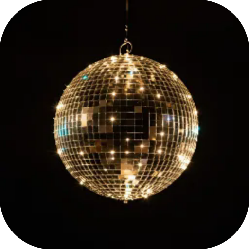

# Рейв

**Техно-грув-бокс: плеєр із науково обґрунтованим генератором (евклідові ритми, синкопа, оцінка груву), повна матриця 22 голоси x 16 кроків, спільний FX-рек (drive, crush, delay, reverb, майстер-фільтр, swing) і збережені біти. Тіло — повноекранний 3D-спектр: десять сцен, які гортаєш, і кожна реагує на живий мікс. Синтез наживо легкими голосами, без семплів, офлайн.**

  

 

---

**Screens** Біт · Пади · Збережені  ·  **Capabilities** —  ·  **Offline** yes  ·  **Installable** yes

Part of the **[microspec farm](../../)** — an AI-authored, gated micro-PWA. Every screen is accessible,
responsive, installable and offline by construction. Browse the whole set from the **[store](../store/)**.

Generated from `spec.json` + `i18n/` by `deploy/readme.mjs` — edit the app, not this file.
