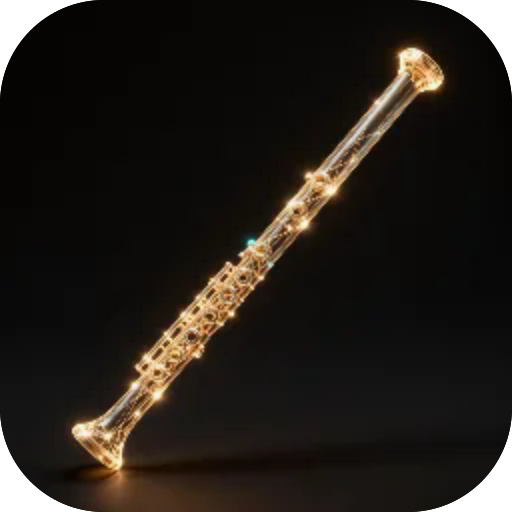

# Сопілка

**Українська сопілка-прима — діатонічна, 6 отворів, до-мажор. Аплікатура як на справжній: закриваєш отвори згори, ковзаєш пальцем — і нота тягнеться легато. Синтезується наживо, без семплів, офлайн**

  

---

**Screens** Грати  ·  **Capabilities** —  ·  **Offline** yes  ·  **Installable** yes

Part of the **[microspec farm](../../)** — an AI-authored, gated micro-PWA. Every screen is accessible,
responsive, installable and offline by construction. Browse the whole set from the **[store](../store/)**.

Generated from `spec.json` + `i18n/` by `deploy/readme.mjs` — edit the app, not this file.
