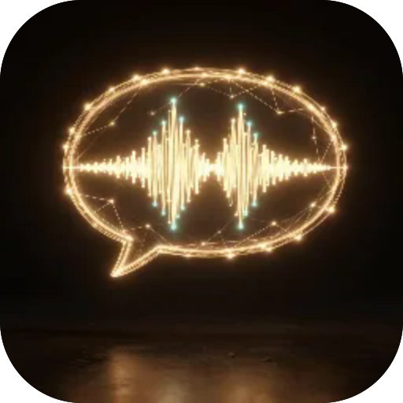

# Голос у текст

**Перетворює голосове повідомлення з Телеграму на текст повністю офлайн. Поділіться голосівкою просто в застосунок або відкрийте аудіофайл — мовлення розпізнається на вашому пристрої, без хмари й без акаунта: українська, російська та англійська з автоматичним вибором мови. Модель кожної мови завантажується один раз і далі працює без мережі.**

  

---

**Screens** Текст  ·  **Capabilities** —  ·  **Offline** yes  ·  **Installable** yes

Part of the **[microspec farm](../../)** — an AI-authored, gated micro-PWA. Every screen is accessible,
responsive, installable and offline by construction. Browse the whole set from the **[store](../store/)**.

Generated from `spec.json` + `i18n/` by `deploy/readme.mjs` — edit the app, not this file.
