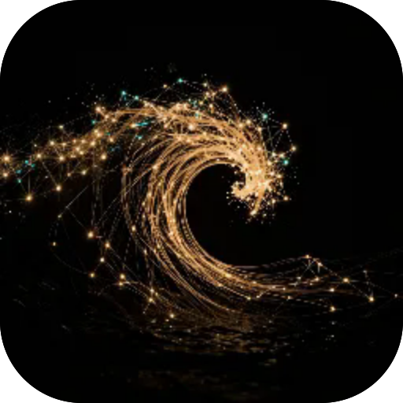

# Tide

**Живі течії звуку за WebGL-полем, що несе палітру кожної станції й дихає разом із сигналом. Шість течій — Deep, Groove, Signal, Bass, Україна, Roots — шістдесят станцій, плавні переходи, керування з екрана блокування.**

  

---

**Screens** Слухати  ·  **Capabilities** —  ·  **Offline** yes  ·  **Installable** yes

Part of the **[microspec farm](../../)** — an AI-authored, gated micro-PWA. Every screen is accessible,
responsive, installable and offline by construction. Browse the whole set from the **[store](../store/)**.

Generated from `spec.json` + `i18n/` by `deploy/readme.mjs` — edit the app, not this file.
