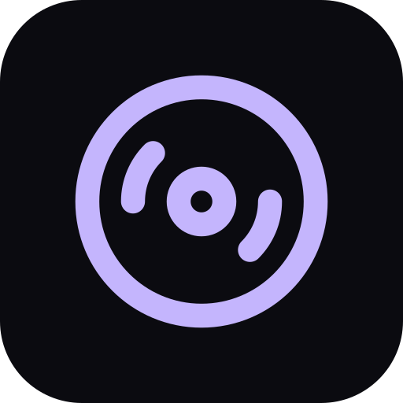

# V2 Плеєр

**Плеєр чіптюнів Farbrausch V2 (.v2m) — демосценний синтезатор, що вміщує цілі композиції в кілька кілобайтів. Магазин читає архів modland V2 наживо: трек зазвичай 20–60 КБ, у десятки разів менше за ту саму музику в MP3, тому качається миттєво й лишається назавжди. Синтезатор V2 працює в браузері як власноруч зібраний WebAssembly-модуль, що рендерить PCM на AudioWorklet; плеєр малює власні байти треку в 3D. Фонове відтворення з керуванням на локскріні. Офлайн.**

  

 

---

**Screens** Плеєр · Магазин · Бібліотека  ·  **Capabilities** —  ·  **Offline** yes  ·  **Installable** yes

Part of the **[microspec farm](../../)** — an AI-authored, gated micro-PWA. Every screen is accessible,
responsive, installable and offline by construction. Browse the whole set from the **[store](../store/)**.

Generated from `spec.json` + `i18n/` by `deploy/readme.mjs` — edit the app, not this file.
